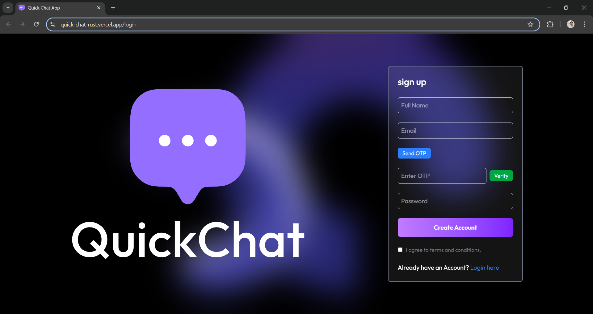
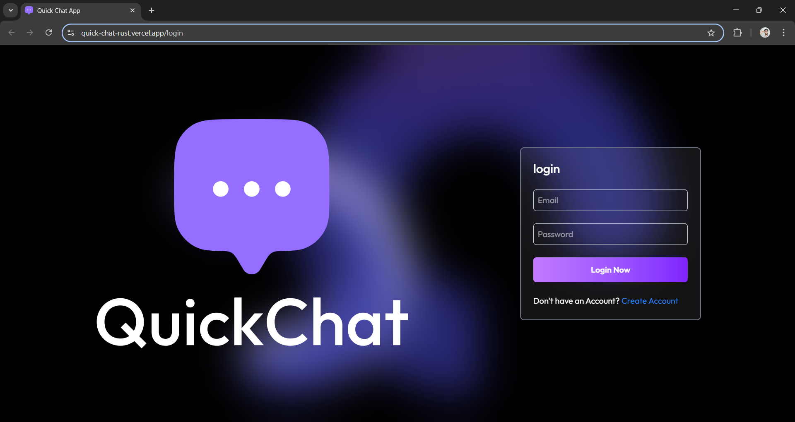
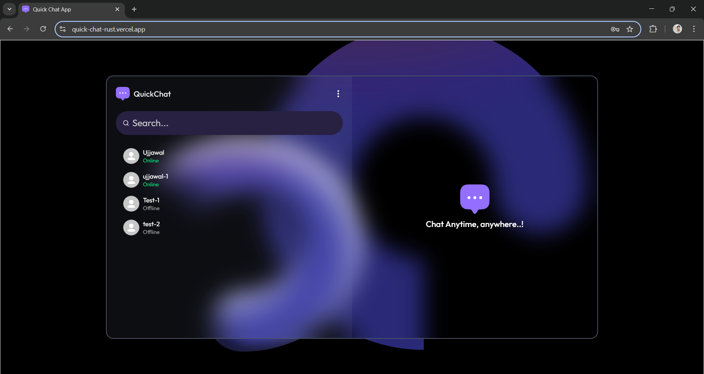

# 💬 Quick-Chat - Real-Time Chat Application

**Live Demo**: 🌐 [https://quick-chat-rust.vercel.app](https://quick-chat-rust.vercel.app)

Quick-Chat is a modern, full-stack real-time chat application built with the MERN stack, designed to deliver a secure and seamless messaging experience. It features real-time communication, email OTP authentication, profile management, image messaging, and a responsive UI—all without using Firebase or Google login.

> 📅 Deployed in July 2025 as part of a portfolio + mini project.

---

## 🚀 Features

- 🔐 Email OTP authentication via Nodemailer & MongoDB
- 💬 Real-time messaging using **Socket.io**
- 📷 Image messaging support
- 👤 Profile page with bio, email, and avatar
- 📱 Fully responsive design (Mobile + Desktop)
- 📡 Online user indicator
- 📥 Seen message indicator
- 🎨 Smooth UX with custom loader, toast notifications, and Tailwind styling
- 🔐 Persistent login using Context API + `localStorage`
- 🌙 Dark theme by default (bgImage + Tailwind)
- 🌐 Deployed on **Vercel (Client)** and **Render (Server)**

---

## 🧠 Tech Stack

### 🖥️ Frontend
- React.js + Vite
- Tailwind CSS
- Axios
- React Router DOM
- React Hot Toast

### ⚙️ Backend
- Node.js + Express
- MongoDB + Mongoose
- Socket.io
- Nodemailer (for OTP)
- dotenv + cors

---

## 📸 Screenshots


### 🔐 Signup Page


### 🔐 Login Page


### 💬 Chat Interface


### 👤 Profile Page


---

## 📁 Project Structure

```bash
chat-app/
│
├── client/            
│   └── public/
│   └── src/
│       └── assets/
│       └── pages/
│       └── components/
│       └── context/
│   └── vite.config.js
│   └── vercel.json
│
├── server/             
│   └── controllers/
│   └── models/
│   └── routes/
│   └── utils/
│   └── server.js
│   └── .env
│
├── .gitignore
├── README.md
└── package.json
```

## 🛠️ Setup Instructions
### 🧩 Prerequisites
---
- Node.js and npm installed

- connection URI (Atlas or local)

- sender email for Nodemailer (e.g., Gmail App Password)

### 🔧 Local Development
---
### Clone the repo
git clone https://github.com/your-username/chat-app.git
cd chat-app

### Setup server
```
cd server
npm install
touch .env   # Add MONGO_URI, PORT, EMAIL, EMAIL_PASS
npm run dev
```
### Setup client
```
cd ../client
npm install
npm run dev
```

## 🌍 Deployment Info
### Client (Vercel)

    Vercel auto-deploys from client/

    Use vite.config.js and vercel.json to handle route rewrites

### Server (Render)

    Hosted on Render at: https://chat-backend-bico.onrender.com

    Exposes /api/auth, /api/messages, /api/users, etc.

## 📁 Subfolder README files

    client/README.md: frontend setup, dev info

    server/README.md: backend API endpoints & environment details

## 👨‍💻 Developer Info

    👤 Ujjawal Pratap Singh

    🏫 B.Tech CSE (AIML), NIET Greater Noida

    💼 Portfolio-worthy full-stack chat app project

## 🤝 Contributing

While this is a personal project, I warmly welcome constructive suggestions and contributions.  
Feel free to fork the repo, open issues, or submit a pull request with improvements or features!


## 📜 License

This project is open-source under the MIT License.